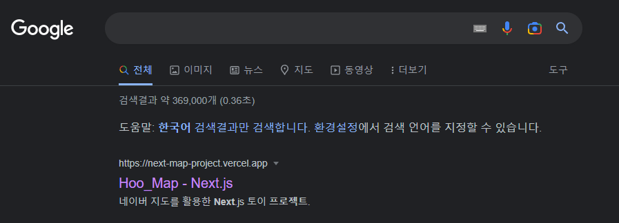

# 네이버 맵을 사용한 Next.js 토이 프로젝트 


# ✅ Topic

- Next.js의 SSR 사용을 익히기 위한 토이 프로젝트
- 네이버 맵 API를 사용 한 지도 서비스


# 📝 Summary

- Next.js를 사용 한 경험은 있지만 SSR을 제대로 사용하지 않고 프로젝트를 진행 했던 점에서 Next.js의 장점인 SSR, SEO, 웹 성능 최적화 기능에 대한 학습을 진행하기 위한 토이 프로젝트 입니다.


# ⚙️ Tech Stack

```
Next.js, SWR, SCSS
```


# ✏️ Learned

- SWR을 이용한 간단한 중앙 상태 관리 학습

- Vercel의 CI/CD를 이용한 서비스 배포
- Next-SEO 라이브러리를 통한 SEO(Naver Search Advisor, Google Search Console), Google Analytics Script 학습
- Crome 개발자 도구의 Lighthouse를 사용한 웹 성능 검사 후 개선
  - https://hoo-dev.tistory.com/entry/Nextjs-Lighthouse%EB%A5%BC-%ED%86%B5%ED%95%9C-%EC%9B%B9-%EC%84%B1%EB%8A%A5-%EA%B2%80%EC%82%AC


# 📷ScreenShot

### 페이지


### 구글 검색 노출 결과



- 배포 페이지 - https://next-map-project.vercel.app/

# ✨ TakeAway

Next.js의 기능을 살린 프로젝트 경험을 해보지 못해 항상 아쉬웠었는데, 이번 토이프로젝트를 통해 Next.js의 Pre-Rendering 방식에 대한 이해를 할 수 있었고, SEO를 통해 네이버와 구글에 제 배포 된 프로젝트를 검색엔진에 노출 시키는 방법과, vercel을 통한 간단한 배포 까지 진행해 볼 수 있었습니다. 

비록 단순한 토이프로젝트지만, 많은 기능에 대한 내용들을 학습해볼 수 있었고 Next.js를 사용했을 때 의 장단점에 대해 알 수 있었습니다.
